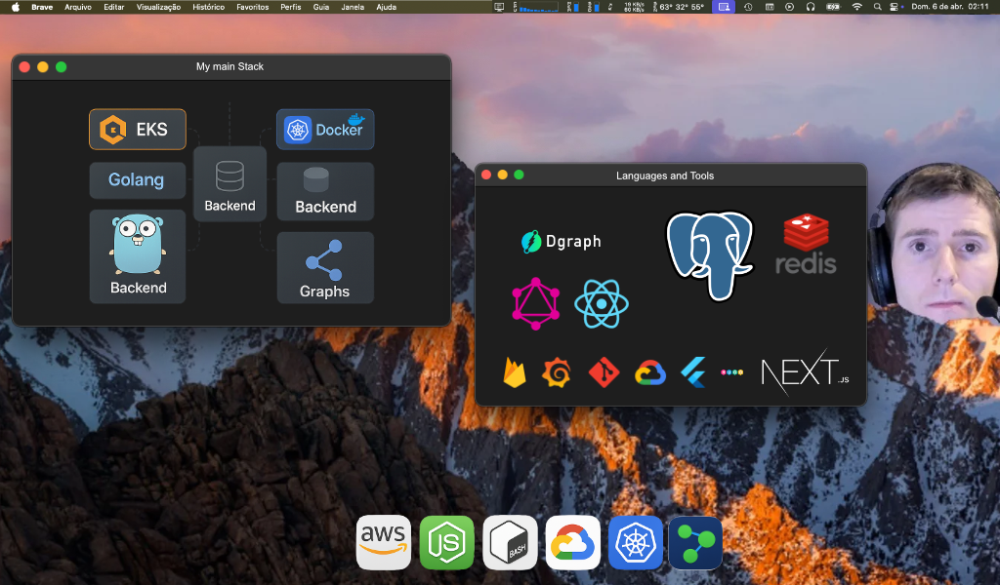

<h1 align="center">Hi 👋, I'm Michel</h1>
<h3 align="center">Passionate for Backend and GraphDBs, developer from Brazil.</h3>

Easy Contact via: https://keybase.io/micheldiz

  

  

&nbsp;

- 🌱 I’m currently learning **Rust**

- 🤝 I’m looking to help with **Graphs!**

- 💬 Ask me about **Dgraph, GraphQL, Graph Modeling**

&nbsp;

